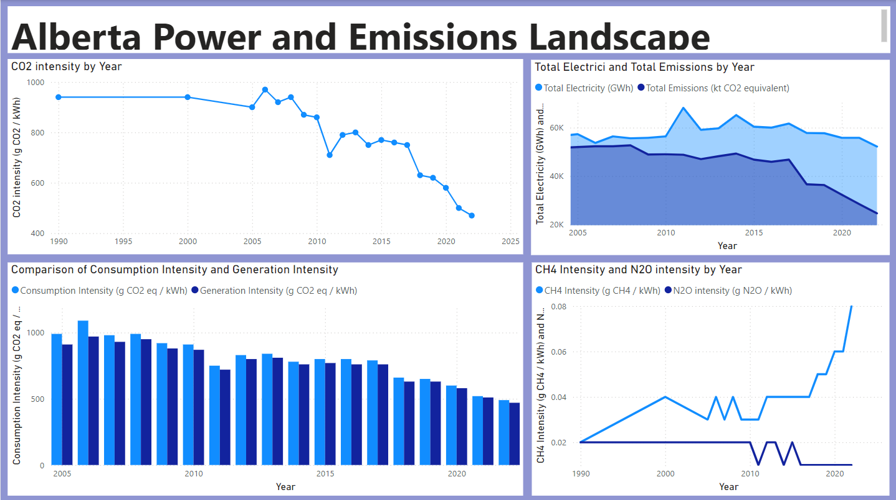

# Alberta Powerplants Emissions Dashboard

This repository showcases a Power BI dashboard that visualizes Alberta's emissions landscape due to powerplants. The dashboard was created as part of a research project and utilizes data from multiple sources to provide an interactive and dynamic view of emissions over time.

## Data Sources
1. **AESO Historical Demand and Supply Data**: This dataset provides hourly data for all the years available.
2. **Government of Canada Reporting Greenhouse Gas Emissions Data**: This dataset includes emissions data which was filtered to include only Alberta and the powerplant category.

## Data Integration
   - Merged datasets using a combination of SQL-like joins and fuzzy matching techniques to handle discrepancies and ensure comprehensive data coverage.
   - Validated data integrity post-merge using a series of checks and balances, including statistical tests and cross-referencing with external data sources.

## Power BI Dashboard
The prepared datasets were used to create an interactive Power BI dashboard. The dashboard allows users to explore and analyze emissions data dynamically.

## Note on Data and Insights
Due to the nature of the research project, I am not allowed to share the actual data or the specific insights derived from the dashboard. However, the structure and functionality of the dashboard can be viewed in the provided video and screenshots!

## Dashboard Description
- The dashboard visualizes emissions data from Alberta's powerplants, providing insights into trends and patterns over time.
- Interactive elements allow users to filter and drill down into specific aspects of the data.

## Screenshots 
Here are some files demonstrating the interactive features of the dashboard:

 

  

  

  

## Insights
Although specific insights cannot be shared, the dashboard provides a comprehensive view of emissions data, enabling users to identify key trends and patterns in Alberta's powerplant emissions landscape.

## Conclusion
This repository demonstrates my ability to handle complex data engineering tasks and create interactive Power BI dashboards. The attached files give a sense of the dashboard's capabilities.

